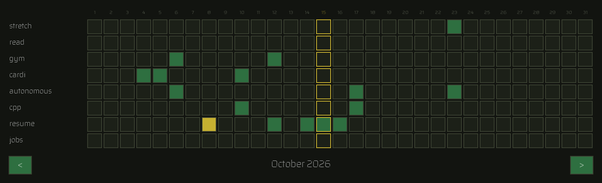

# HabitTracker

A year of habits, one square per day.



## Download

Grab your platform's archive from the [Releases](../../releases/latest) page:

| Platform | File |
| --- | --- |
| Windows | `HabitTracker-windows-x86_64.zip` |
| macOS (Intel and Apple Silicon) | `HabitTracker-macos.tar.gz` |
| Linux | `HabitTracker-linux-x86_64.tar.gz` |

Extract it and run `HabitTracker` (`HabitTracker.exe` on Windows). It can be
launched from anywhere — a shortcut, a dock, your `PATH` — because it finds its
font and data next to itself rather than in whatever directory you happened to
start it from.

On first run it asks in the terminal which habits you want to track. After that
it goes straight to the grid.

## Using it

| Action | Effect |
| --- | --- |
| **Left click** a square | Mark the day done (green) |
| **Right click** a square | Mark the day partial (yellow) |
| Click the **same** mark again | Clear the day |
| Click the **other** mark | Switch straight to it |
| **←** / **→**, or the `<` / `>` buttons | Previous / next month |
| **Ctrl+S** | Save now |
| **Esc** | Quit |

Today's column is outlined in yellow when you're looking at the current month.

Your marks are saved automatically — a couple of seconds after each change, and
again when you quit. There is no way to lose a session by closing the window the
wrong way.

### Options

```
HabitTracker [--data-dir <path>] [--font <path>] [--year <n>] [--month <1-12>]
```

`--year` opens a different year; each year is its own file. By default the app
opens the current year and month.

## Your data

One file per year, in `data/` next to the executable (or wherever
`$HABITTRACKER_DATA_DIR` points):

```
habittracker	2
year	2026
habit	read for 20 minutes	000100...	...
```

Tab-separated, one line per habit, one character per day (`0` unmarked, `1` done,
`2` partial), with the habit's name on its own line — so habits are matched
between months by name, and reordering the lines by hand is safe.

Saving writes a temporary file and renames it over the old one, so an interrupted
write cannot leave a half-written year behind. The previous version is kept
alongside as `<year>.habits.bak`.

If a data file is present but unreadable, the app says so and exits **without
writing anything**. It will not start fresh over data it could not parse.

### Upgrading from the old format

Version 1 stored twelve files named `month0`…`month11`. If those are present and
there's no `<year>.habits` yet, they're imported automatically into the current
year, matched up by habit name. The old files are left exactly where they are, so
nothing is lost if the import isn't what you wanted.

## Building

Requires a C++20 compiler and CMake 3.21+. SFML 2.x is used if it's installed,
and downloaded and built from source if it isn't.

```sh
cmake -B build -DCMAKE_BUILD_TYPE=Release
cmake --build build
ctest --test-dir build --output-on-failure
```

There's also a Makefile for quick local builds:

```sh
make          # build the app and run the tests
make run
make check    # tests only
```

### Layout

```
src/core/    The model: marks, dates, habits, months, years, and their files.
             No SFML — every rule in here is testable without a window.
src/view/    Drawing and hit-testing. Owns no habit data.
src/app/     The window, the event loop, and first-run setup.
tests/       The test suite. Links only src/core, so it needs no display.
```

The split is the point: `src/core` holds the invariants (a track always matches
its month's length; every month of a year tracks the same habits in the same
order; a habit name can never contain a character that would corrupt the file),
and nothing above it can violate them.

Warnings are on and treated as errors in CI: `-Wall -Wextra -Wpedantic -Wshadow
-Wconversion -Wsign-conversion -Wold-style-cast` and friends. CI builds and tests
on Linux, macOS, and Windows on every push, and builds both the CMake and the
Makefile targets so they can't drift apart.
